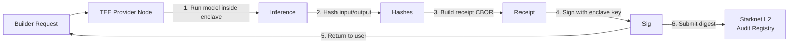

# Patronaige

**Startup Inference Access** — connecting early-stage teams with the AI compute they need to build, without upfront costs.

Patronaige matches startups with inference providers who want upside in what you build — revenue share, equity, or hybrid. No flat-rate rental. No one-size-fits-all.

---

## How It Works

1. **Apply** — Tell us what you're building and what compute you need.
2. **Match** — We pair you with providers that fit your stack and stage.
3. **Deploy** — Compute flows. You build. Providers verify usage via TEE.
4. **Settle** — When you win, they win. Revenue share or equity, per deal.

---

## Deal Structures

| Structure | How It Works |
|-----------|-------------|
| **Revenue Share** | Percentage of revenue until a predefined cap. Cash flows. Simple math. |
| **Equity Stake** | Share of the company in exchange for sustained compute access. Long-term alignment. |
| **Hybrid** | Mix of both. Tailored to the startup's stage, capital needs, and growth trajectory. |

---

## Why Trust Matters

Inference providers need to know their compute is used for the agreed purpose. Startups need to prove it without overhead. Patronaige solves this with **hardware-signed receipts**:

- Every inference run is attested by a TEE enclave (AWS Nitro / Intel SGX)
- Receipt digests are anchored on-chain (Starknet L2) — immutable audit trail
- Providers verify usage. Startups stay focused. No paperwork. No disputes.

This is the trust layer that makes non-traditional deal structures viable. **It enables the platform. It isn't the platform.**

---

## Technical Stack



**Components:**
1. **Builder Client** — sends prompt, receives completion + receipt
2. **Provider Daemon** — runs inside TEE; produces signed receipts
3. **Audit Registry (Cairo)** — on-chain contract anchoring receipt digests
4. **Frontend (React/Vite)** — portal for startups and providers

---

## Quickstart

### Run a provider (dev mode)
```bash
cd provider
npm install
npx ts-node daemon.ts "llama-3.2-1B" "Explain quantum entanglement simply"
```
Generates a mock receipt (signed with local ed25519 key).

### Validate a receipt
```bash
npm i ajv ajv-formats cbor
node -e "const v=require('./provider/validator'); v.validateReceipt(JSON.parse(process.argv[1]))" "$(cat receipt.json)"
```

### Deploy the Cairo contract
```bash
starkli declare contracts/Verification.cairo --account $ACCOUNT
starkli deploy $CLASS_HASH --account $ACCOUNT
```

---

## Economics

| Role | What They Do |
|------|-------------|
| **Startup** | Receives compute, pays only when they grow (rev-share or equity) |
| **Provider** | Deploys idle capacity, earns upside from startup success |
| **Challenger** | Watches chain for invalid receipts, earns bounty from slashed stake |

Patronaige takes a small cut only when a deal succeeds. Aligned incentives — no one gets paid unless the startup ships.

---

## Repository

- **Frontend (you are here):** https://github.com/karlostoteles/PatronAIge
- **Audit specs:** https://github.com/spiritclawd/patronaige
- **Live site:** https://patronaige.com

---

## Contact

**Carlos de la Figuera** — Founder  
📧 carlosdelafiguera@gmail.com

---

*Patronaige — access the compute you need. Pay with what you build.*
